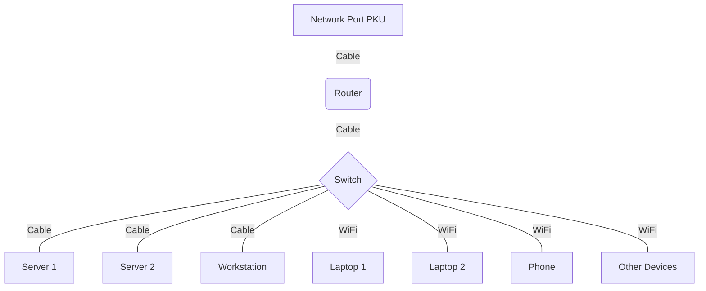
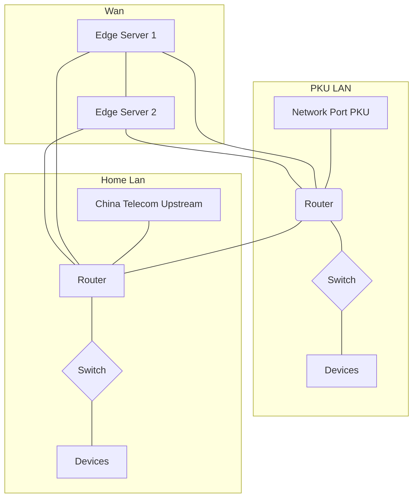

# Networking

- Network Topology
- Network Configuration
- Best Practice

---

# Network Topology
Networking

Local Network Topology:

- 1 Router, connected to upstream PKU network
  - 1000Mbps full-duplex upstream/downstream
- 1 Switch, connected to all devices
  - 1000Mbps full-duplex upstream/downstream
- Multiple devices, connected to the switch

<div class="abs-tr h-full display-flex items-center">



</div>

---

# Network Topology
Networking

Global Network Topology:

- Every internal device only connect to its LAN
- All routers and edge devices are also connected to a VPN
- Routers will forward all cross-LAN traffic
- All devices are mutually accessible

<div class="abs-tr h-full display-flex items-center">



</div>

---

# Network Configuration
Networking

The network provided by PKU have a few limitations:

- One IPv4 address
  - We must use NAT for our LAN to share the same address
  - Also, login into ITS is required to access internet
- One `/64` IPv6 address
  - Requires advanced configuration for our LAN devices to get a global IPv6 address
  - Also, our IPv6 firewall **do not allow incoming traffic**

---

# Network Configuration
Networking

Thus, for IPv4, I chose the following configuration:

- Local DHCP enabled, assigning `192.168.2.x` address
- NAT enabled, forwarding all traffic to the upstream
- Firewall enabled, reject all incoming traffic except allowed ports
- Port forwarding
  - Auto forwarding: NAT-PMP and UPnP
  - Manual forwarding: SSH, Samba, etc.

---

# Network Configuration
Networking

For IPv6, following configuration is used:

- DHCP mode set to `relay`. See also: [OpenWRT Docs](https://openwrt.org/docs/guide-user/network/ipv6/configuration#ipv6_relay)
- No NAT
- Firewall & Port forwarding is the same as IPv4

---

# Network Configuration
Networking

Result:

```
Ethernet adapter Ethernet:

   Connection-specific DNS Suffix  . : lan
   IPv6 Address. . . . . . . . . . . : 240c:c001:1:2ad7:f051:9a98:xxxx:yyyy
   Temporary IPv6 Address. . . . . . : 240c:c001:1:2ad7:805f:54f8:zzzz:wwww
   Link-local IPv6 Address . . . . . : fe80::f051:9a98:aaaa:bbbb%17
   IPv4 Address. . . . . . . . . . . : 192.168.2.8
   Subnet Mask . . . . . . . . . . . : 255.255.255.0
   Default Gateway . . . . . . . . . : fe80::6827:19ff:cccc:dddd%17
                                       192.168.2.1
```

Both IPv4 and IPv6 are working, and the IPv6 address is global.

---

# Network Configuration
Networking

The LAN setup is done. Now, let's talk about the global network

The global network consists of multiple interoperable LANs

To implement that, we can:
- Connect all router and edge devices to a same network, by using a VPN
- Setup traffic forwarding on each router
- Setup routing rules on routers and edge devices

---

# Network Configuration
Networking

For the VPN part, I chose [ZeroTier](https://www.zerotier.com/)

It's a free and open-source VPN solution, which supports both IPv4 and IPv6

Also, it has built-in routing support


---

# Network Configuration
Networking

For traffic forwarding, OpenWRT's `luci-app-zerotier` package provided built-in support


---

# Network Configuration
Networking

Now, we can access all devices from almost anywhere, securely and privately

---

# Best Practice
Networking

- Apply strict firewall rules, allow only necessary ports
- Do not trust WAN traffic, eg. only allow SSH password login from LAN
- Set DHCP address pool to a subnet of your LAN, eg. for `192.168.1.0/24`, use `192.168.1.128/25` for DHCP
  - This will help to identify manually configured devices
  - It's useful when you need to share your network with eg. your roommate
- Use scripts to automatically configure network
  - For example, a cron job is used to auto login into ITS
